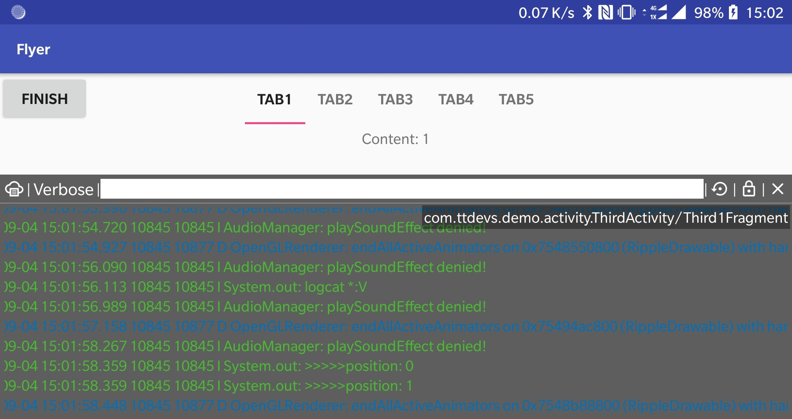

# Flyer

一个在界面上展示Logcat日志信息的工具类。

## 使用

- 权限：`android.permission.SYSTEM_ALERT_WINDOW`
- 打开：`Flyer.show();`
- 关闭：`Flyer.dismiss();`
- 操作：
    - ：上下移动窗口
    - ：清空日志
    - ：打开/关闭自动滚动
    - ：关闭窗口

## 功能

- 已经完成
    - 展示Logcat
    - 设置Log级别
    - 不同级别日志显示不同颜色
    - 移动窗口位置
    - 清空展示窗口
    - 打开/锁定日志滚动
    - 展示当前Activity/Fragment(暂支持v4)
    
- TODO
    - 调整窗口大小
    - 通过关键字过滤日志
    - 保存日志
    - 拷贝日志
    - ...

## Other

 - App中图片来自 [Material Design Icons](https://materialdesignicons.com/)，在此表示感谢
    - xhdpi：
    - xxhdpi：大小72，内容64
    - xxxhdpi：

## Reference

- [UETool](https://github.com/eleme/UETool)
- [ActivityTaskView](https://github.com/rome753/ActivityTaskView)
- [Logcat](https://developer.android.com/studio/command-line/logcat)

## License: MIT

Copyright © 2018 ttdevs

Permission is hereby granted, free of charge, to any person obtaining a copy
of this software and associated documentation files (the “Software”), to deal
in the Software without restriction, including without limitation the rights
to use, copy, modify, merge, publish, distribute, sublicense, and/or sell
copies of the Software, and to permit persons to whom the Software is
furnished to do so, subject to the following conditions:

The above copyright notice and this permission notice shall be included in
all copies or substantial portions of the Software.

THE SOFTWARE IS PROVIDED “AS IS”, WITHOUT WARRANTY OF ANY KIND, EXPRESS OR
IMPLIED, INCLUDING BUT NOT LIMITED TO THE WARRANTIES OF MERCHANTABILITY,
FITNESS FOR A PARTICULAR PURPOSE AND NONINFRINGEMENT. IN NO EVENT SHALL THE
AUTHORS OR COPYRIGHT HOLDERS BE LIABLE FOR ANY CLAIM, DAMAGES OR OTHER
LIABILITY, WHETHER IN AN ACTION OF CONTRACT, TORT OR OTHERWISE, ARISING FROM,
OUT OF OR IN CONNECTION WITH THE SOFTWARE OR THE USE OR OTHER DEALINGS IN
THE SOFTWARE.

